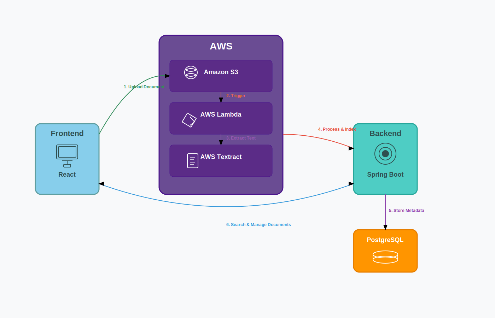

# Cloud-Based Medical Document Processing System

A full-stack cloud-based system built to streamline the handling of medical documents such as discharge summaries, lab reports, and clinical notes. 
It enables healthcare professionals to securely upload, extract, search, and manage patient-related content — enhancing accessibility and decision-making in clinical workflows.

## 📌 Features

- User registration and login
- Document upload with type validation
- Supports multipart upload for large files (100MB+)
- Secure file download
- Text extraction from uploaded files (via AWS Lambda)
- Full-text and fuzzy search using Apache Lucene
- Document metadata storage and retrieval

## 🛠️ Tech Stack

| Layer        | Technology                        | Purpose                                  |
|--------------|-----------------------------------|------------------------------------------|
| Frontend     | React                             | User interface and interactions          |
| Backend      | Spring Boot (Java)                | API layer and business logic             |
| Database     | PostgreSQL                        | Store metadata and user info             |
| Storage      | AWS S3                            | Store uploaded documents                 |
| Search       | Apache Lucene                     | Indexing and full-text search            |
| Extraction   | AWS Lambda + Apache Tika/OCR      | Serverless text extraction               |
| Deployment   | Render (backend), S3 (frontend)   | Scalable cloud hosting                   |

## How It Works

1. **Upload**: User uploads a document via the React frontend.
2. **Storage**: File is uploaded to AWS S3, metadata is saved to PostgreSQL.
3. **Text Extraction**: AWS Lambda function extracts text using AWS Textract.
4. **Indexing**: Extracted text is indexed using Lucene for fast retrieval.
5. **Search**: User can perform full-text and fuzzy keyword searches across all their documents using Apache Lucene.
6. **Download**: Documents are available for download from S3.
7. **View**: User can view the documents that he uploaded.

## Deployment

- **Frontend** hosted on: `AWS S3 Static Website Hosting`
- **Backend** deployed to: `Render`
- Supports session-based login, CORS setup, and cookie management for cross-origin communication.

## Prerequisites

- Java 17+
- Node.js 18+
- AWS CLI configured (for S3 + Lambda)
- PostgreSQL instance 

